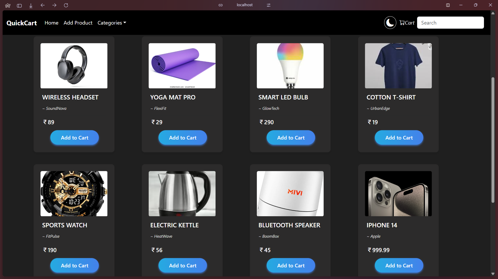
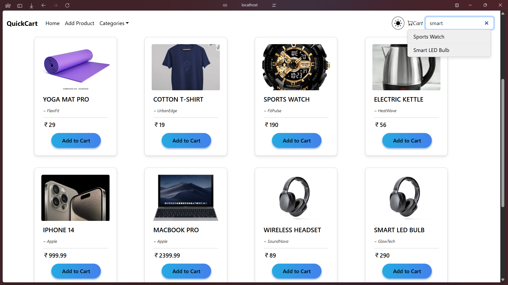
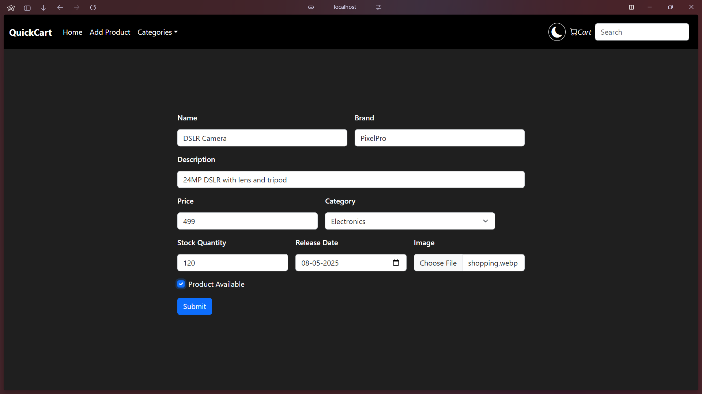
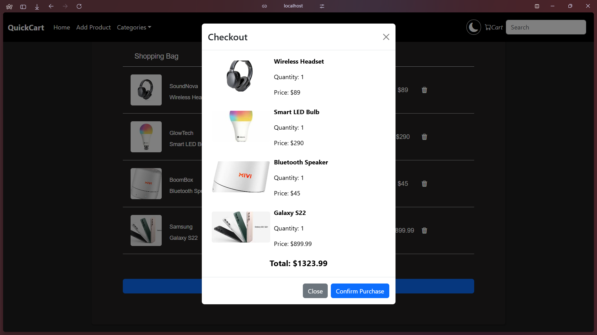

# 🛒 QuickCart – Full Stack E-Commerce App

A full-stack e-commerce web application built with **React** (frontend) and **Java Spring Boot** (backend). Features include product management, cart functionality, search, and image uploads, powered by PostgreSQL and REST APIs.

---

## 🚀 Tech Stack

- **Frontend:** React, Axios, JavaScript
- **Backend:** Java 21, Spring Boot, Spring MVC, Spring Data JPA
- **Database:** PostgreSQL
- **Build Tool:** Maven

---

## ✨ Features

- Product CRUD (Create, Read, Delete)
- Image upload for products
- Keyword-based product search
- Add to Cart / Remove from Cart
- RESTful API architecture
- Clean frontend-backend integration with Axios

---

## 📁 Folder Structure


QuickCart/
├── SpringEcom/               # Backend (Spring Boot)
│   └── src/...
├── ecom-frontend-5-main/     # Frontend (React)
│   └── src/...
🔧 How to Run
🔹 Backend (Spring Boot)


<pre> ```bash cd SpringEcom ``` </pre>
./mvnw spring-boot:run
Make sure PostgreSQL is running and your database credentials are set correctly in application.properties.

🔹 Frontend (React)

<pre> ```bash cd ecom-frontend-5-main
npm install
npm run dev ``` </pre>
Ensure the backend server is running before launching the frontend.

## 🌐 API Overview
Endpoint	Method	Description
/api/products	GET	Get all products
/api/products	POST	Add new product
/api/products/{id}	DELETE	Delete a product
/api/search?query=	GET	Search products by name
/api/cart	POST	Add item to cart
/api/cart/{id}	DELETE	Remove item from cart
/api/upload	POST	Upload product image

## 🔄 Notes
React app uses Axios to consume backend REST APIs.

CORS is configured to allow cross-origin requests from frontend to backend.

Ensure backend is up before interacting with the React app.

## 📸 Screenshots
### 🏠 Home Page

### Search By Keyword

### Add new product

### Cart

### Checkout

